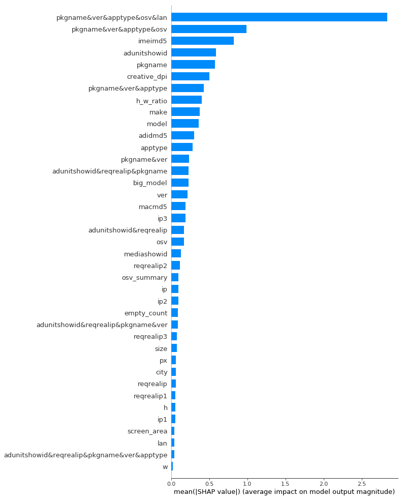
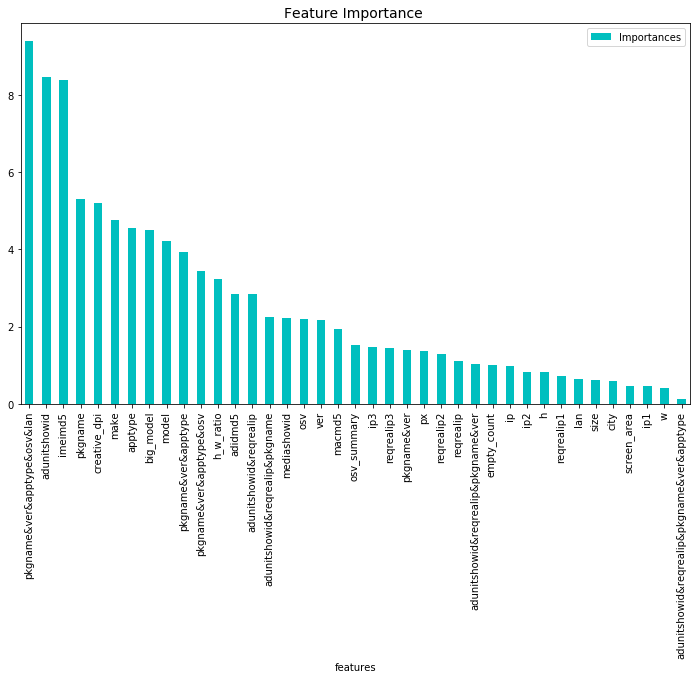
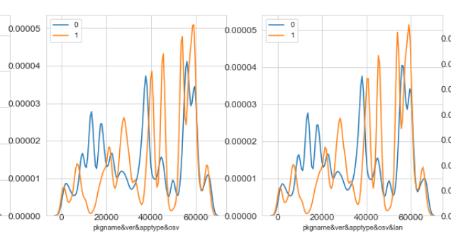
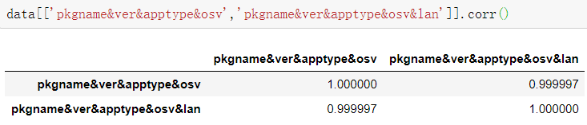

# 对挑选组合特征的方法的探究

catboost的max_ctr_complexity控制进行内部特征组合时，进行组合的特征的个数，默认为4，但内存无法承受。调整为1后内存可行，但分数有所下降。

基本结论：进行特征的组合可以在相同模型和特征的情况下增加分数。

问题：进行特征组合后爆内存的原因？catboost组合特征的方法（分数上升稳定）？避开模型进行特征组合的方法？


### 方法1：在相同中心特征情况下，逐渐增加组合起来的特征个数

```python
data['pkgname&ver'] = data['pkgname'].astype(str)+'&'+data['ver'].astype(str)
data['pkgname&ver&apptype'] = data['pkgname'].astype(str)+'&'+data['ver'].astype(str)+'&'+data['apptype'].astype(str)
data['pkgname&ver&apptype&osv'] = data['pkgname'].astype(str)+'&'+data['ver'].astype(str)+'&'+data['apptype'].astype(str)+'&'+data['osv'].astype(str)
data['pkgname&ver&apptype&osv&lan'] = data['pkgname'].astype(str)+'&'+data['ver'].astype(str)+'&'+data['apptype'].astype(str)+'&'+data['osv'].astype(str)+'&'+data['lan'].astype(str)

data['adunitshowid&reqrealip'] = data['adunitshowid'].astype(str)+'&'+data['reqrealip'].astype(str)
data['adunitshowid&reqrealip&pkgname'] = data['adunitshowid'].astype(str)+'&'+data['reqrealip'].astype(str)+'&'+data['pkgname'].astype(str)
data['adunitshowid&reqrealip&pkgname&ver'] = data['adunitshowid'].astype(str)+'&'+data['reqrealip'].astype(str)+'&'+data['pkgname'].astype(str)+'&'+data['ver'].astype(str)
data['adunitshowid&reqrealip&pkgname&ver&apptype'] = data['adunitshowid'].astype(str)+'&'+data['reqrealip'].astype(str)+'&'+data['pkgname'].astype(str)+'&'+data['ver'].astype(str)+'&'+data['apptype'].astype(str)
```


实验：

f1:0.9847646533






1. pkgname&ver&apptype&osv在shap中位列第二，但在重要度中跌幅较大
2. adunitshowid&reqrealip越加特征效果越差；pkgname&ver相反
3. 种类数也并没有很好的相关性

4. 

   shap最高两特征在分布图形上几乎一样，种类也非常相近，为何第一会比第二高出不少？

   尝试删掉原第一：f1下降：0.9847646533-》0.9846877684

   删掉原第二：f1轻微上升：0.9847646533-》0.984776908 

   原因：共线性