**特征选择测试记录**

# **模型参数**

catboost == 0.15.2

learning_rate=0.1,

max_depth=8,

early_stopping_rounds=100,

boosting_type='Plain',

max_bin=15,

max_ctr_complexity=1

# **实验记录**

## **实验1**

2019/8/26 20:23

训练时间(不含处理数据时间): 1 min 43 s

最佳轮数: 1831

f1: 0.9743

### **shap** 

​             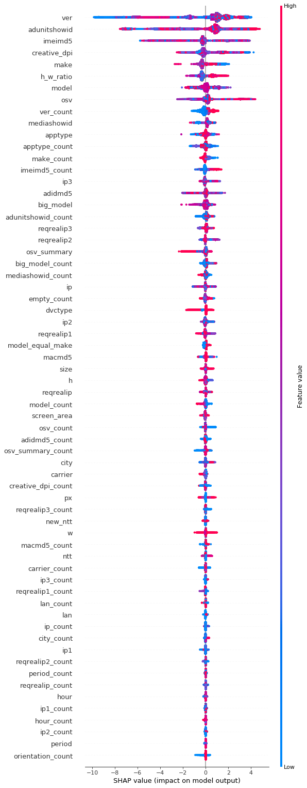             

​             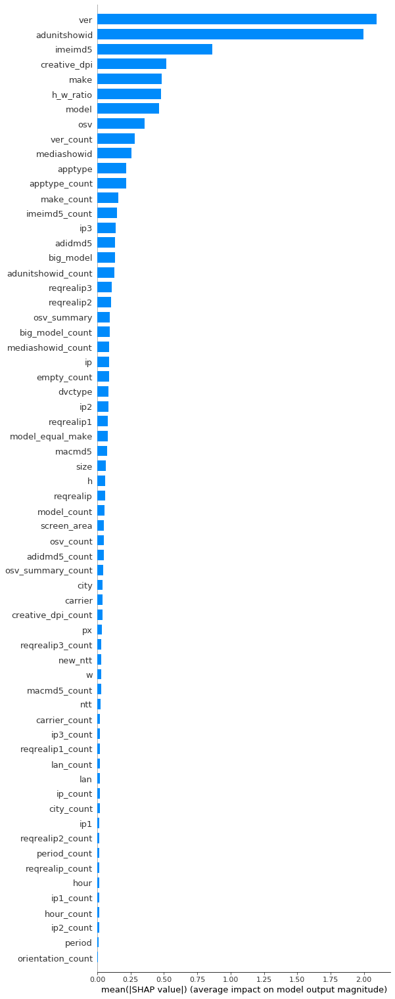             

### **feature importance**

​             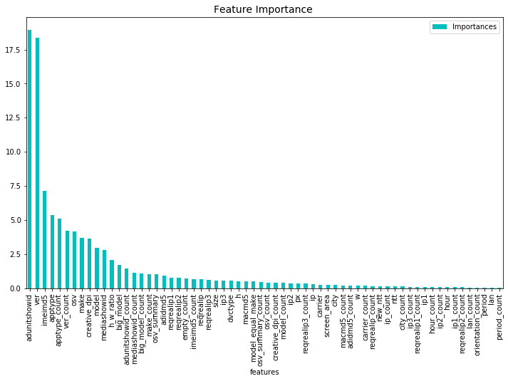             

### **Interaction**

​             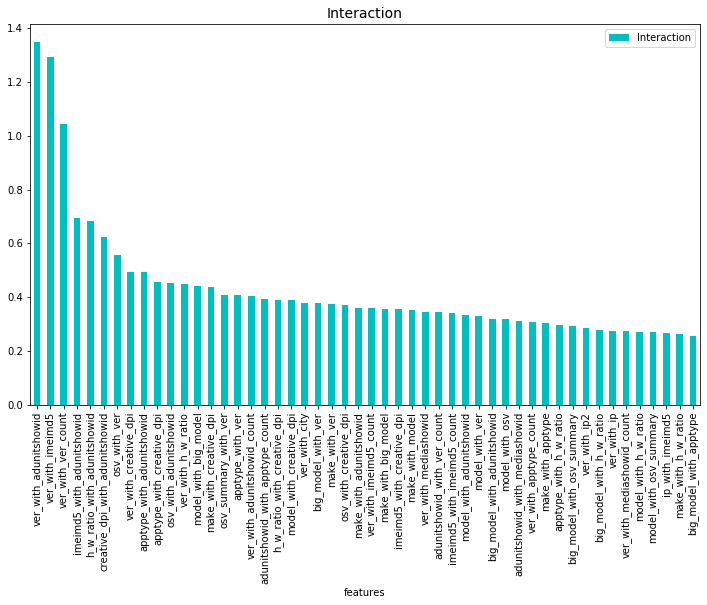             

### **特征状态**

['make', 'model', 'big_model', 'model_equal_make', 'dvctype', 'apptype', 'carrier', 'lan', 'ntt', 'new_ntt', 'osv', 'osv_summary', 'ver', 'ip', 'ip1', 'reqrealip', 'ip2', 'ip3', 'reqrealip1', 'reqrealip2', 'reqrealip3', 'hour', 'period', 'adidmd5', 'imeimd5', 'macmd5', 'city', 'h', 'w', 'h_w_ratio', 'screen_area', 'size', 'creative_dpi', 'px', 'adunitshowid', 'mediashowid', 'ver_count', 'adunitshowid_count', 'mediashowid_count', 'apptype_count', 'ip_count', 'city_count', 'reqrealip_count', 'adidmd5_count', 'imeimd5_count', 'macmd5_count', 'model_count', 'make_count', 'carrier_count', 'osv_count', 'orientation_count', 'lan_count', 'hour_count', 'period_count', 'ip1_count', 'ip2_count', 'ip3_count', 'reqrealip1_count', 'reqrealip2_count', 'reqrealip3_count', 'osv_summary_count', 'big_model_count', 'creative_dpi_count', 'empty_count']

删去 ['preiod_count','lan','period','orientation_count','lan_count','reqrealip2_count']

## **实验2**

2019/8/26 22:24

训练时间(不含处理数据时间): 1 min 15 s

最佳轮数: 1394

f1: 0.9743563183

### **shap** 

​                          

​             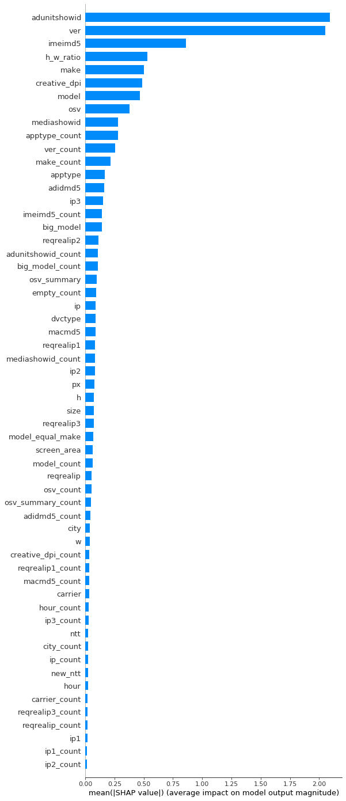             

### **feature importance**

​             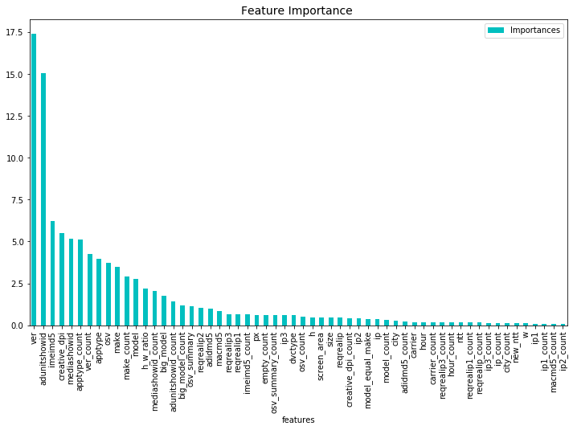             

### **Interaction**

​             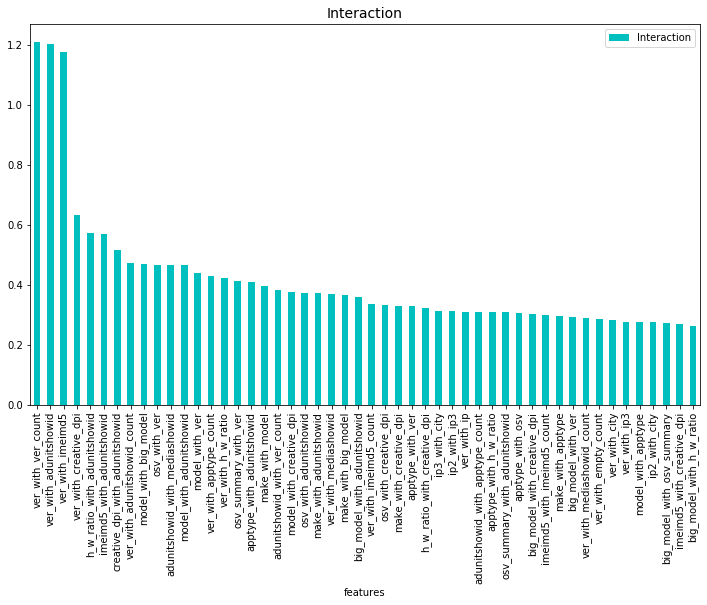             

### **特征状态**

['make', 'model', 'big_model', 'model_equal_make', 'dvctype', 'apptype', 'carrier', 'ntt', 'new_ntt', 'osv', 'osv_summary', 'ver', 'ip', 'ip1', 'reqrealip', 'ip2', 'ip3', 'reqrealip1', 'reqrealip2', 'reqrealip3', 'hour', 'adidmd5', 'imeimd5', 'macmd5', 'city', 'h', 'w', 'h_w_ratio', 'screen_area', 'size', 'creative_dpi', 'px', 'adunitshowid', 'mediashowid', 'ver_count', 'adunitshowid_count', 'mediashowid_count', 'apptype_count', 'ip_count', 'city_count', 'reqrealip_count', 'adidmd5_count', 'imeimd5_count', 'macmd5_count', 'model_count', 'make_count', 'carrier_count', 'osv_count', 'hour_count', 'ip1_count', 'ip2_count', 'ip3_count', 'reqrealip1_count', 'reqrealip3_count', 'osv_summary_count', 'big_model_count', 'creative_dpi_count', 'empty_count']

删去 ['ip2_count','ip1_count','ip1','reqrealip_count','reqrealip3_count',

​             'carrier_count','hour','new_ntt','ip_count']

## **实验3**

2019/8/26 23:17

训练时间(不含处理数据时间): 1 min 25 s

最佳轮数: 1570

f1: 0.9743923358

### **shap** 

​             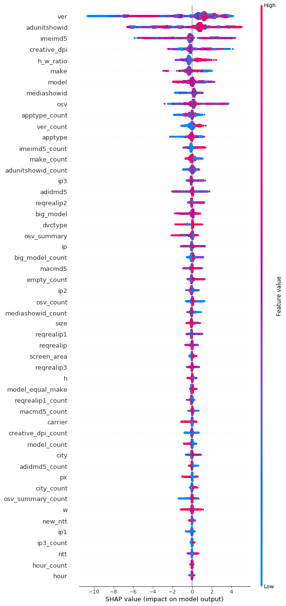             

​                          

### **feature importance**

​             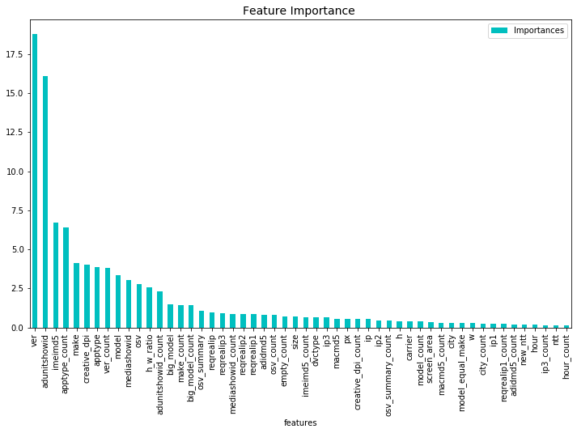             

### **Interaction**

​             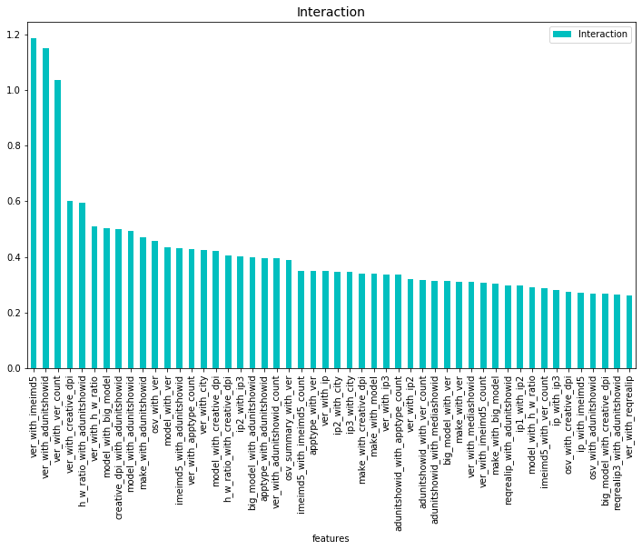             

### **特征状态**

['make', 'model', 'big_model', 'model_equal_make', 'dvctype', 'apptype', 'carrier', 'ntt', 'new_ntt', 'osv', 'osv_summary', 'ver', 'ip', 'ip1', 'reqrealip', 'ip2', 'ip3', 'reqrealip1', 'reqrealip2', 'reqrealip3', 'hour', 'adidmd5', 'imeimd5', 'macmd5', 'city', 'h', 'w', 'h_w_ratio', 'screen_area', 'size', 'creative_dpi', 'px', 'adunitshowid', 'mediashowid', 'ver_count', 'adunitshowid_count', 'mediashowid_count', 'apptype_count', 'city_count', 'adidmd5_count', 'imeimd5_count', 'macmd5_count', 'model_count', 'make_count', 'osv_count', 'hour_count', 'ip3_count', 'reqrealip1_count', 'osv_summary_count', 'big_model_count', 'creative_dpi_count', 'empty_count']

删去 ['hout_count','ip3_count','osv_summary_count'] 轻微下降

取消清洗 ['make','osv'] 轻微下降 0.974352584

增加 ['ver_with_adunitshowid', 'reqrealip_with_adunitshowid', 'mediashowid_with_adunitshowid', 

,'ver_with_adunitshowid_count', 'reqrealip_with_adunitshowid_count', 'mediashowid_with_adunitshowid_count']

## **实验4**

2019/8/26 23:17

训练时间(不含处理数据时间): 1 min 25 s

最佳轮数: 1570

f1: 0.9743923358

### **shap** 

​             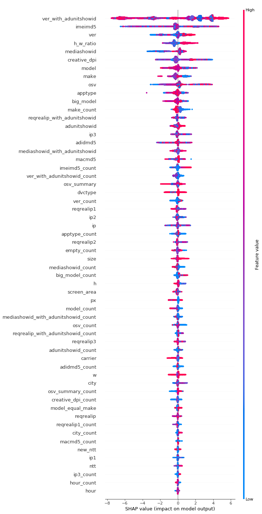             

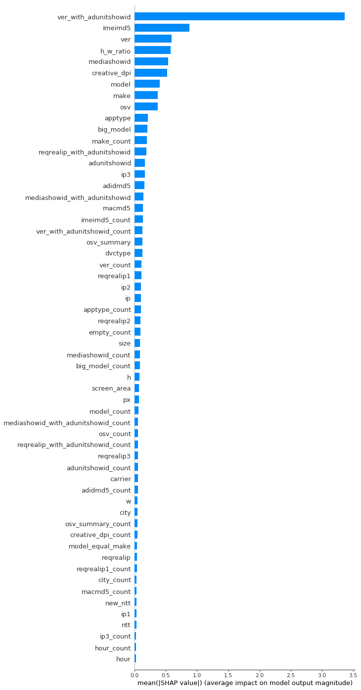

### **feature importance**

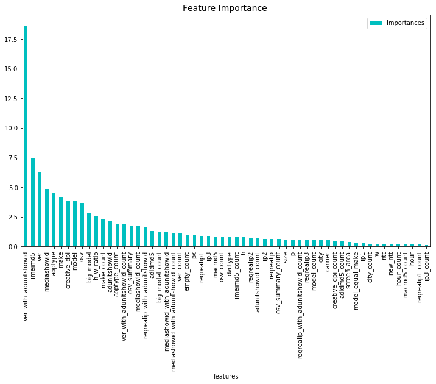

### **Interaction**

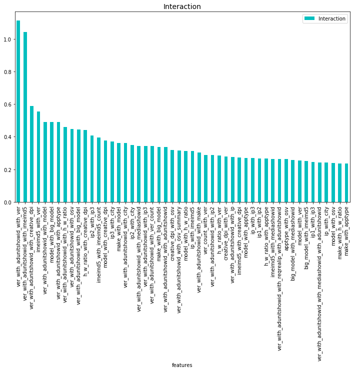             

### **特征状态**

['make', 'model', 'big_model', 'model_equal_make', 'dvctype', 'apptype', 'carrier', 'ntt', 'new_ntt', 'osv', 'osv_summary', 'ver', 'ip', 'ip1', 'reqrealip', 'ip2', 'ip3', 'reqrealip1', 'reqrealip2', 'reqrealip3', 'hour', 'adidmd5', 'imeimd5', 'macmd5', 'city', 'h', 'w', 'h_w_ratio', 'screen_area', 'size', 'creative_dpi', 'px', 'adunitshowid', 'mediashowid', 'ver_count', 'adunitshowid_count', 'mediashowid_count', 'apptype_count', 'city_count', 'adidmd5_count', 'imeimd5_count', 'macmd5_count', 'model_count', 'make_count', 'osv_count', 'hour_count', 'ip3_count', 'reqrealip1_count', 'osv_summary_count', 'big_model_count', 'creative_dpi_count', 'empty_count']

删去 ['hout_count','ip3_count','osv_summary_count'] 轻微下降

取消清洗 ['make','osv'] 轻微下降 0.974352584

增加 ['ver_with_adunitshowid', 'reqrealip_with_adunitshowid', 'mediashowid_with_adunitshowid', 

,'ver_with_adunitshowid_count', 'reqrealip_with_adunitshowid_count', 'mediashowid_with_adunitshowid_count']

## 实验5

2019/8/27 17:24

训练时间(不含处理数据时间): 3m 58s s 1060

最佳轮数: 1094

f1: 0.9850719073

### **shap** 

​                          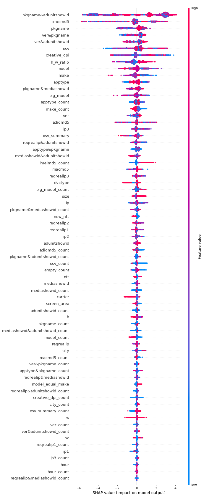

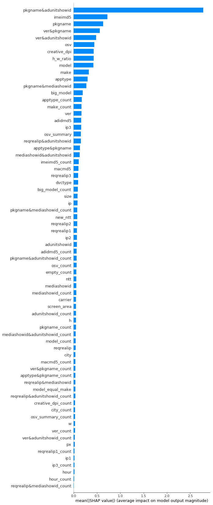

### **feature importance**

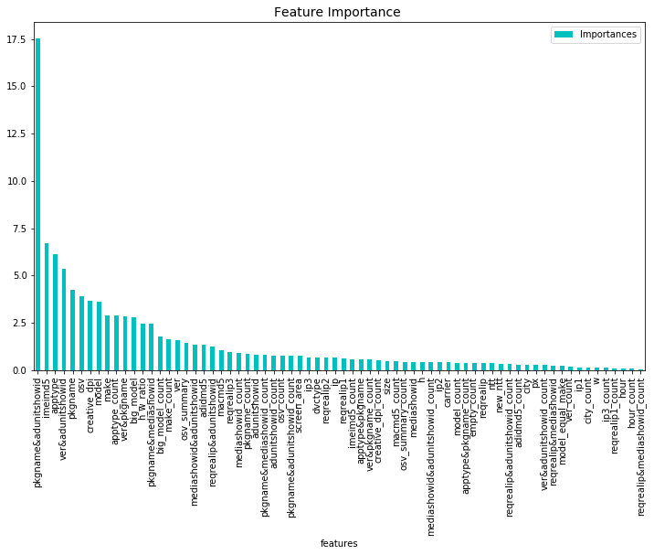

### **Interaction**

​             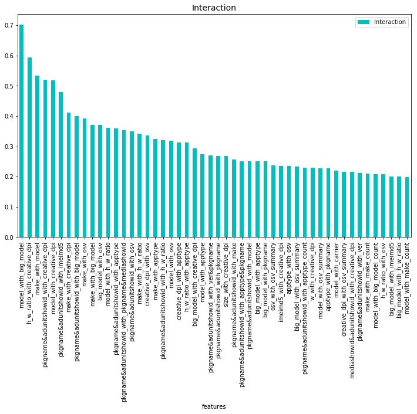

### **特征状态**

['pkgname&adunitshowid', 'ver&adunitshowid', 'reqrealip&adunitshowid', 'mediashowid&adunitshowid', 'apptype&pkgname', 'ver&pkgname', 'reqrealip&mediashowid', 'pkgname&mediashowid', 'empty_count', 'make', 'model', 'big_model', 'model_equal_make', 'ip', 'ip1', 'reqrealip', 'ip2', 'ip3', 'reqrealip1', 'reqrealip2', 'reqrealip3', 'adidmd5', 'imeimd5', 'macmd5', 'adunitshowid', 'mediashowid', 'city', 'h', 'w', 'h_w_ratio', 'screen_area', 'size', 'creative_dpi', 'px', 'make_count', 'model_count', 'big_model_count', 'ip3_count', 'reqrealip1_count', 'adidmd5_count', 'imeimd5_count', 'macmd5_count', 'adunitshowid_count', 'mediashowid_count', 'city_count', 'creative_dpi_count', 'apptype_count', 'osv_count', 'osv_summary_count', 'ver_count', 'pkgname_count', 'hour_count', 'pkgname&adunitshowid_count', 'ver&adunitshowid_count', 'reqrealip&adunitshowid_count', 'mediashowid&adunitshowid_count', 'apptype&pkgname_count', 'ver&pkgname_count', 'reqrealip&mediashowid_count', 'pkgname&mediashowid_count', 'dvctype', 'apptype', 'carrier', 'ntt', 'new_ntt', 'osv', 'osv_summary', 'ver', 'pkgname', 'hour']

## 实验5

2019/8/27 17:24

训练时间(不含处理数据时间): 3m 58s s 1060

最佳轮数: 1094

f1: 0.9850719073

### **shap** 

​                          

### **feature importance**

### **Interaction**

​             

### **特征状态**

['pkgname&adunitshowid', 'ver&adunitshowid', 'reqrealip&adunitshowid', 'mediashowid&adunitshowid', 'apptype&pkgname', 'ver&pkgname', 'reqrealip&mediashowid', 'pkgname&mediashowid', 'empty_count', 'make', 'model', 'big_model', 'model_equal_make', 'ip', 'ip1', 'reqrealip', 'ip2', 'ip3', 'reqrealip1', 'reqrealip2', 'reqrealip3', 'adidmd5', 'imeimd5', 'macmd5', 'adunitshowid', 'mediashowid', 'city', 'h', 'w', 'h_w_ratio', 'screen_area', 'size', 'creative_dpi', 'px', 'make_count', 'model_count', 'big_model_count', 'ip3_count', 'reqrealip1_count', 'adidmd5_count', 'imeimd5_count', 'macmd5_count', 'adunitshowid_count', 'mediashowid_count', 'city_count', 'creative_dpi_count', 'apptype_count', 'osv_count', 'osv_summary_count', 'ver_count', 'pkgname_count', 'hour_count', 'pkgname&adunitshowid_count', 'ver&adunitshowid_count', 'reqrealip&adunitshowid_count', 'mediashowid&adunitshowid_count', 'apptype&pkgname_count', 'ver&pkgname_count', 'reqrealip&mediashowid_count', 'pkgname&mediashowid_count', 'dvctype', 'apptype', 'carrier', 'ntt', 'new_ntt', 'osv', 'osv_summary', 'ver', 'pkgname', 'hour']

## 实验5

2019/8/27 17:24

训练时间(不含处理数据时间): 3m 58s s 1060

最佳轮数: 1094

f1: 0.9850719073

### **shap** 

​                          

### **feature importance**

### **Interaction**

​             

### **特征状态**

['pkgname&adunitshowid', 'ver&adunitshowid', 'reqrealip&adunitshowid', 'mediashowid&adunitshowid', 'apptype&pkgname', 'ver&pkgname', 'reqrealip&mediashowid', 'pkgname&mediashowid', 'empty_count', 'make', 'model', 'big_model', 'model_equal_make', 'ip', 'ip1', 'reqrealip', 'ip2', 'ip3', 'reqrealip1', 'reqrealip2', 'reqrealip3', 'adidmd5', 'imeimd5', 'macmd5', 'adunitshowid', 'mediashowid', 'city', 'h', 'w', 'h_w_ratio', 'screen_area', 'size', 'creative_dpi', 'px', 'make_count', 'model_count', 'big_model_count', 'ip3_count', 'reqrealip1_count', 'adidmd5_count', 'imeimd5_count', 'macmd5_count', 'adunitshowid_count', 'mediashowid_count', 'city_count', 'creative_dpi_count', 'apptype_count', 'osv_count', 'osv_summary_count', 'ver_count', 'pkgname_count', 'hour_count', 'pkgname&adunitshowid_count', 'ver&adunitshowid_count', 'reqrealip&adunitshowid_count', 'mediashowid&adunitshowid_count', 'apptype&pkgname_count', 'ver&pkgname_count', 'reqrealip&mediashowid_count', 'pkgname&mediashowid_count', 'dvctype', 'apptype', 'carrier', 'ntt', 'new_ntt', 'osv', 'osv_summary', 'ver', 'pkgname', 'hour']

## 实验6

2019/8/27 22:18

训练时间(不含处理数据时间): 14m 19s s 1060

最佳轮数: 1699

f1: 0.9852130354

### **shap** 

​                    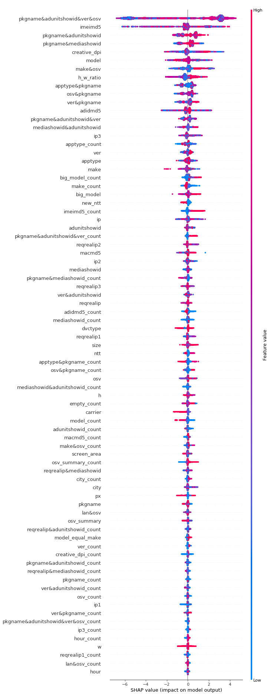

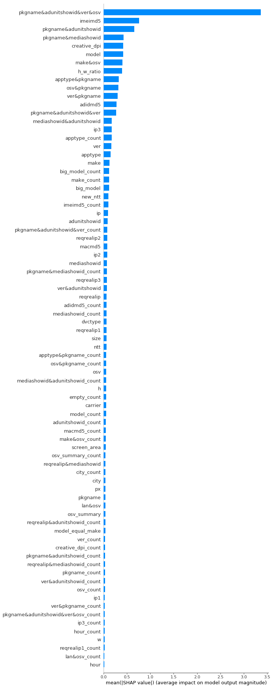

### **feature importance**

### **Interaction**

​          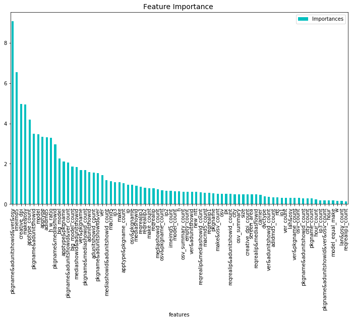

### **特征状态**

['pkgname&adunitshowid', 'ver&adunitshowid', 'mediashowid&adunitshowid', 'apptype&pkgname', 'ver&pkgname', 'osv&pkgname', 'reqrealip&mediashowid', 'pkgname&mediashowid', 'pkgname&adunitshowid&ver', 'pkgname&adunitshowid&ver&osv', 'lan&osv', 'make&osv', 'empty_count', 'make', 'model', 'big_model', 'model_equal_make', 'ip', 'ip1', 'reqrealip', 'ip2', 'ip3', 'reqrealip1', 'reqrealip2', 'reqrealip3', 'adidmd5', 'imeimd5', 'macmd5', 'adunitshowid', 'mediashowid', 'city', 'h', 'w', 'h_w_ratio', 'screen_area', 'size', 'creative_dpi', 'px', 'pkgname&adunitshowid_count', 'ver&adunitshowid_count', 'reqrealip&adunitshowid_count', 'mediashowid&adunitshowid_count', 'apptype&pkgname_count', 'ver&pkgname_count', 'osv&pkgname_count', 'reqrealip&mediashowid_count', 'pkgname&mediashowid_count', 'pkgname&adunitshowid&ver_count', 'pkgname&adunitshowid&ver&osv_count', 'lan&osv_count', 'make&osv_count', 'make_count', 'model_count', 'big_model_count', 'ip3_count', 'reqrealip1_count', 'adidmd5_count', 'imeimd5_count', 'macmd5_count', 'adunitshowid_count', 'mediashowid_count', 'city_count', 'creative_dpi_count', 'apptype_count', 'osv_count', 'osv_summary_count', 'ver_count', 'pkgname_count', 'hour_count', 'dvctype', 'apptype', 'carrier', 'ntt', 'new_ntt', 'osv', 'osv_summary', 'ver', 'pkgname', 'hour']

## 实验7

训练时间(不含处理数据时间): 1

最佳轮数: 

f1: 0.98486

### **shap** 

​           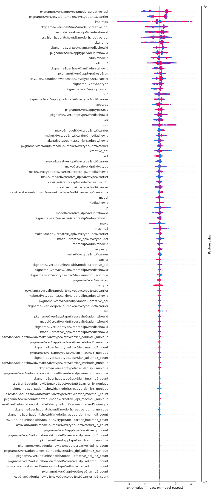         

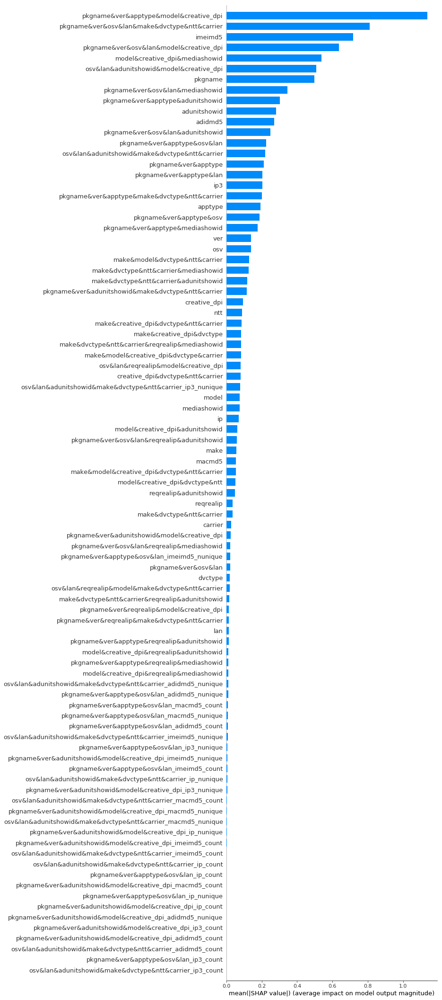

### **feature importance**

### **Intera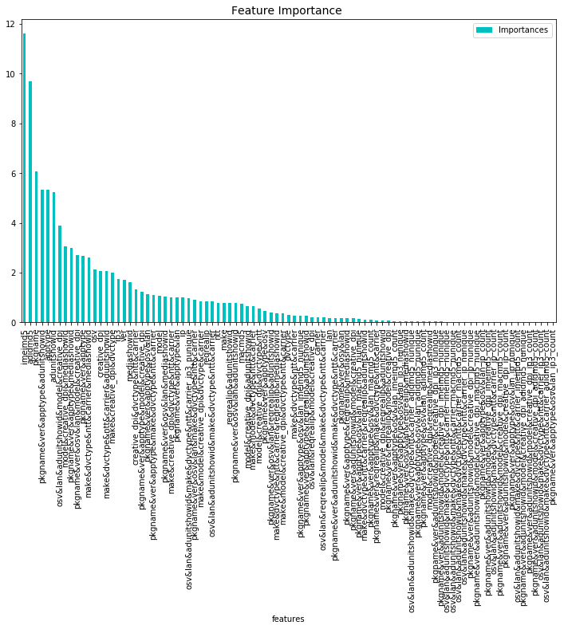interaction**

​          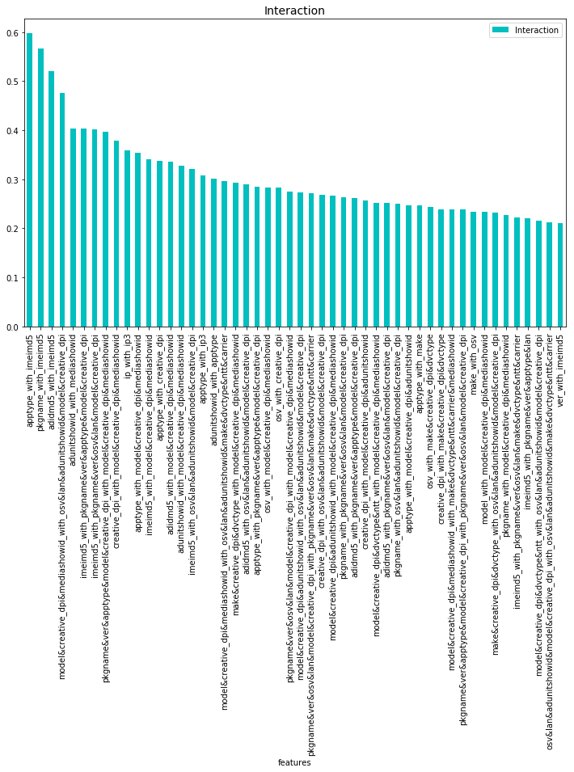

### **特征状态**

['pkgname', 'ver', 'adunitshowid', 'mediashowid', 'apptype', 'ip', 'reqrealip', 'adidmd5', 'imeimd5', 'macmd5', 'dvctype', 'model', 'make', 'ntt', 'carrier', 'osv', 'lan', 'ip3', 'creative_dpi', 'make&model&creative_dpi&dvctype&ntt&carrier', 'reqrealip&adunitshowid', 'pkgname&ver&apptype&osv&lan', 'make&creative_dpi&dvctype&ntt&carrier', 'make&dvctype&ntt&carrier', 'make&creative_dpi&dvctype', 'make&model&dvctype&ntt&carrier', 'make&model&creative_dpi&dvctype&carrier', 'creative_dpi&dvctype&ntt&carrier', 'model&creative_dpi&dvctype&ntt', 'pkgname&ver&osv&lan', 'pkgname&ver&apptype&lan', 'pkgname&ver&apptype&osv', 'pkgname&ver&apptype', 'pkgname&ver&apptype&reqrealip&adunitshowid', 'pkgname&ver&apptype&reqrealip&mediashowid', 'pkgname&ver&osv&lan&reqrealip&adunitshowid', 'pkgname&ver&osv&lan&reqrealip&mediashowid', 'pkgname&ver&apptype&adunitshowid', 'pkgname&ver&apptype&mediashowid', 'pkgname&ver&osv&lan&adunitshowid', 'pkgname&ver&osv&lan&mediashowid', 'pkgname&ver&apptype&model&creative_dpi', 'pkgname&ver&apptype&make&dvctype&ntt&carrier', 'pkgname&ver&osv&lan&model&creative_dpi', 'pkgname&ver&osv&lan&make&dvctype&ntt&carrier', 'model&creative_dpi&reqrealip&adunitshowid', 'model&creative_dpi&reqrealip&mediashowid', 'make&dvctype&ntt&carrier&reqrealip&adunitshowid', 'make&dvctype&ntt&carrier&reqrealip&mediashowid', 'model&creative_dpi&adunitshowid', 'model&creative_dpi&mediashowid', 'make&dvctype&ntt&carrier&adunitshowid', 'make&dvctype&ntt&carrier&mediashowid', 'pkgname&ver&adunitshowid&model&creative_dpi', 'osv&lan&adunitshowid&model&creative_dpi', 'pkgname&ver&reqrealip&model&creative_dpi', 'osv&lan&reqrealip&model&creative_dpi', 'pkgname&ver&adunitshowid&make&dvctype&ntt&carrier', 'osv&lan&adunitshowid&make&dvctype&ntt&carrier', 'pkgname&ver&reqrealip&make&dvctype&ntt&carrier', 'osv&lan&reqrealip&model&make&dvctype&ntt&carrier', 'pkgname&ver&adunitshowid&model&creative_dpi_ip_nunique', 'pkgname&ver&adunitshowid&model&creative_dpi_ip_count', 'pkgname&ver&adunitshowid&model&creative_dpi_ip3_nunique', 'pkgname&ver&adunitshowid&model&creative_dpi_ip3_count', 'pkgname&ver&adunitshowid&model&creative_dpi_imeimd5_nunique', 'pkgname&ver&adunitshowid&model&creative_dpi_imeimd5_count', 'pkgname&ver&adunitshowid&model&creative_dpi_macmd5_nunique', 'pkgname&ver&adunitshowid&model&creative_dpi_macmd5_count', 'pkgname&ver&adunitshowid&model&creative_dpi_adidmd5_nunique', 'pkgname&ver&adunitshowid&model&creative_dpi_adidmd5_count', 'osv&lan&adunitshowid&make&dvctype&ntt&carrier_ip_nunique', 'osv&lan&adunitshowid&make&dvctype&ntt&carrier_ip_count', 'osv&lan&adunitshowid&make&dvctype&ntt&carrier_ip3_nunique', 'osv&lan&adunitshowid&make&dvctype&ntt&carrier_ip3_count', 'osv&lan&adunitshowid&make&dvctype&ntt&carrier_imeimd5_nunique', 'osv&lan&adunitshowid&make&dvctype&ntt&carrier_imeimd5_count', 'osv&lan&adunitshowid&make&dvctype&ntt&carrier_macmd5_nunique', 'osv&lan&adunitshowid&make&dvctype&ntt&carrier_macmd5_count', 'osv&lan&adunitshowid&make&dvctype&ntt&carrier_adidmd5_nunique', 'osv&lan&adunitshowid&make&dvctype&ntt&carrier_adidmd5_count', 'pkgname&ver&apptype&osv&lan_ip_nunique', 'pkgname&ver&apptype&osv&lan_ip_count', 'pkgname&ver&apptype&osv&lan_ip3_nunique', 'pkgname&ver&apptype&osv&lan_ip3_count', 'pkgname&ver&apptype&osv&lan_imeimd5_nunique', 'pkgname&ver&apptype&osv&lan_imeimd5_count', 'pkgname&ver&apptype&osv&lan_macmd5_nunique', 'pkgname&ver&apptype&osv&lan_macmd5_count', 'pkgname&ver&apptype&osv&lan_adidmd5_nunique', 'pkgname&ver&apptype&osv&lan_adidmd5_count']