### adunitshowid&city&pkgname

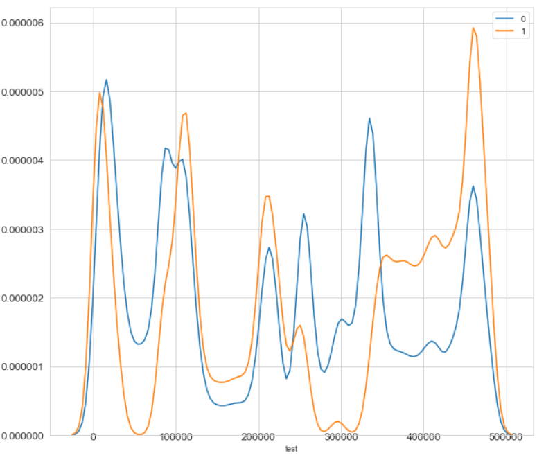

### adunitshowid&pkgname

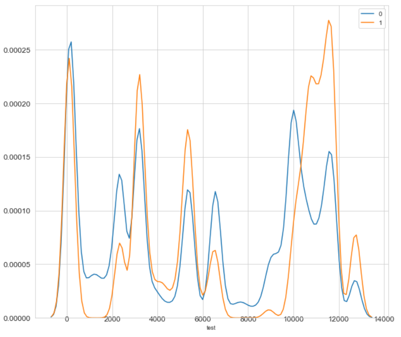

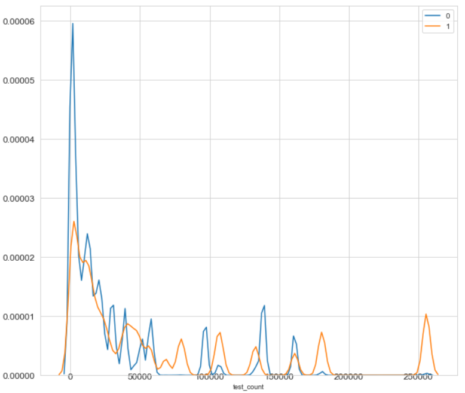

### adunitshowid&city&pkgname&make

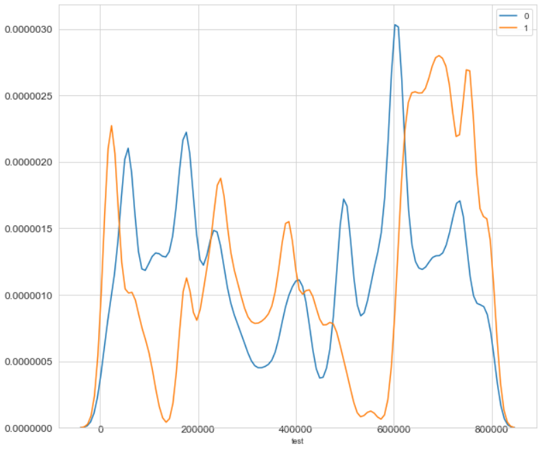

### city&pkgname&make

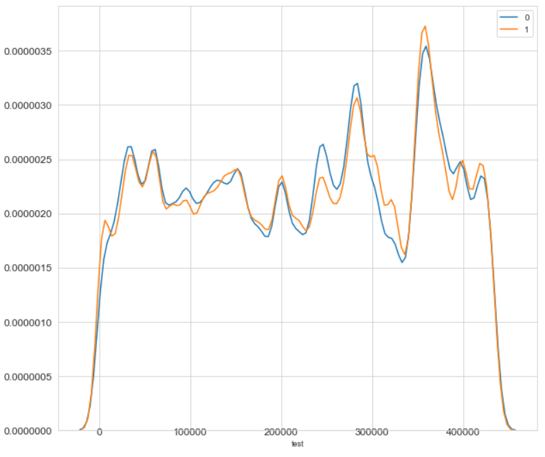

### adunitshowid&pkgname&make

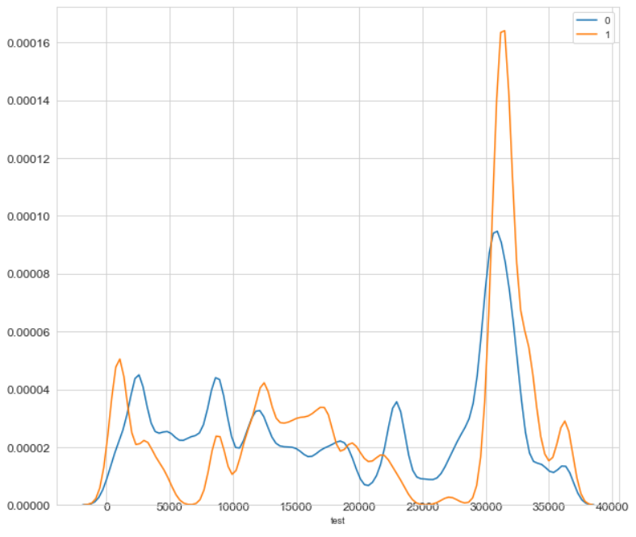

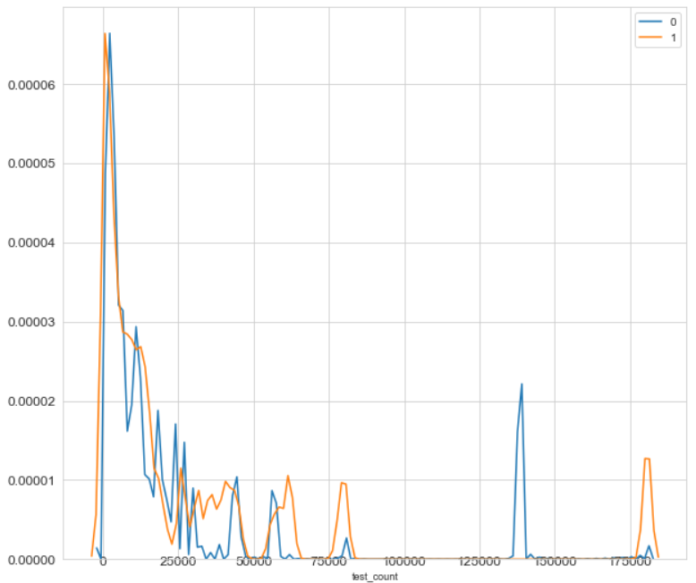

### adunitshowid&ver&make

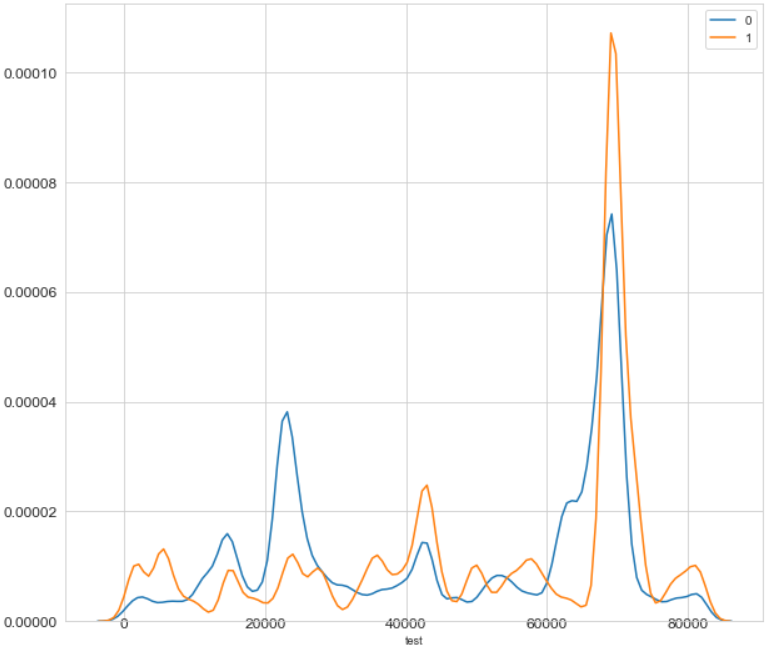

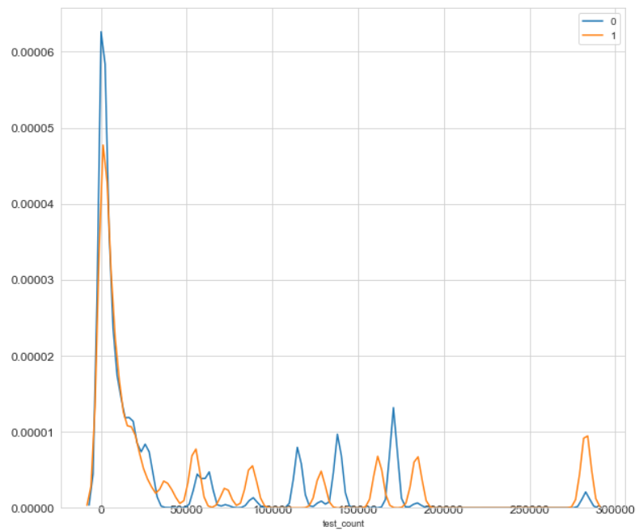

### adunitshowid&ver&make&pkgname

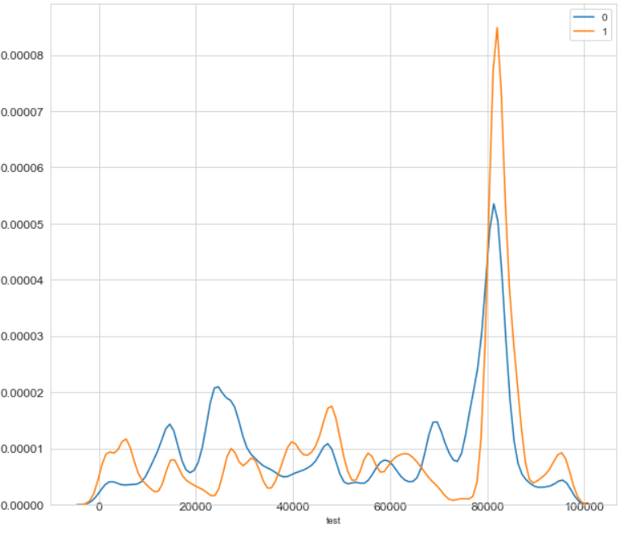

### adunitshowid&make

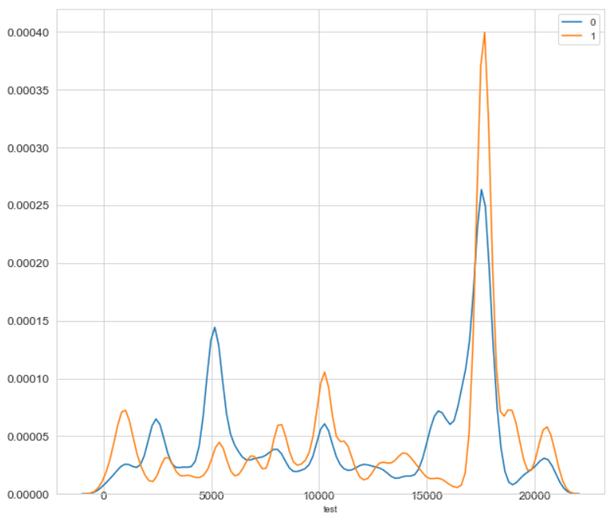

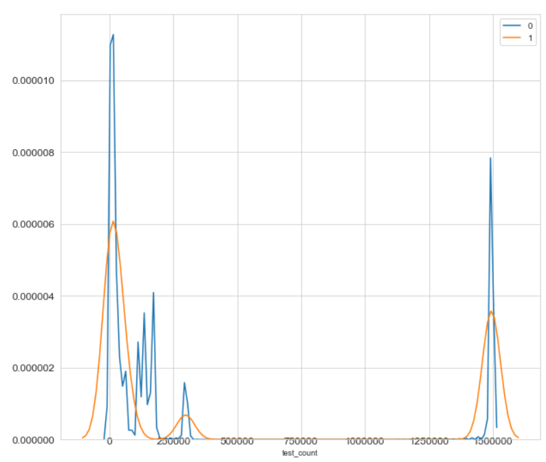

### mediashowid&pkgname&ver

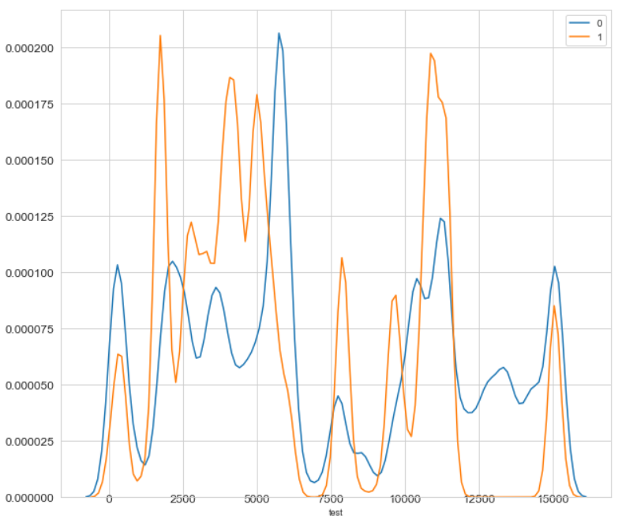

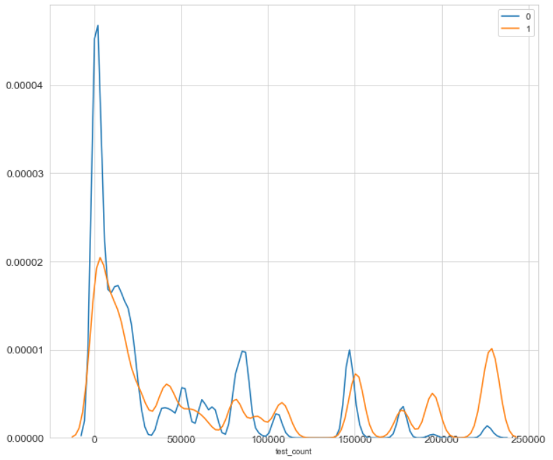

### mediashowid&pkgname&ver&hour

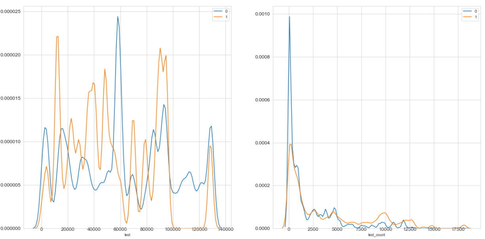

### mediashowid&pkgname&ver&period

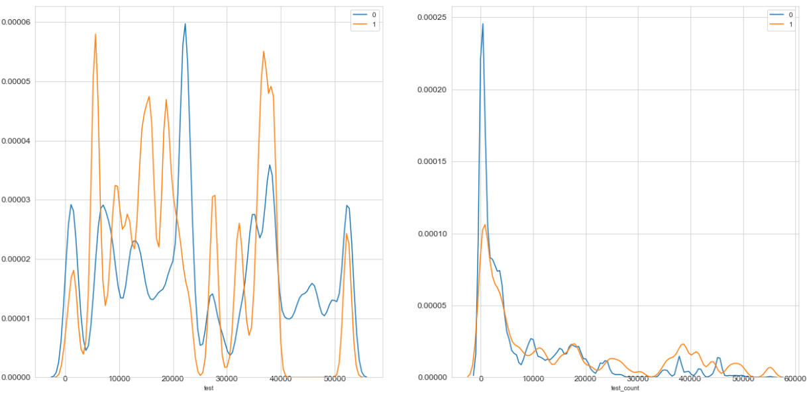

### mediashowid&pkgname

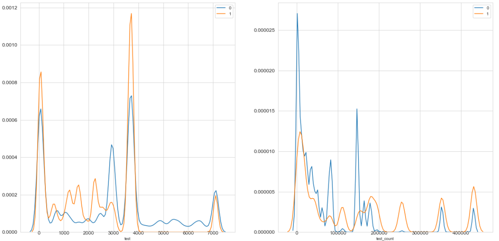

### mediashowid&ver

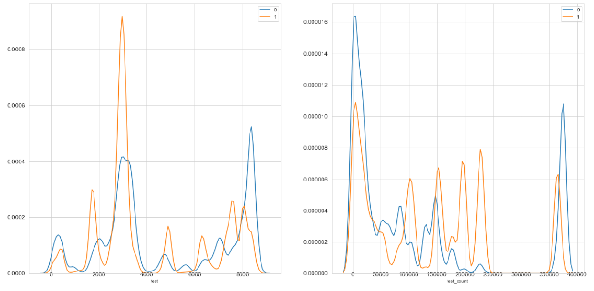

### mediashowid&city

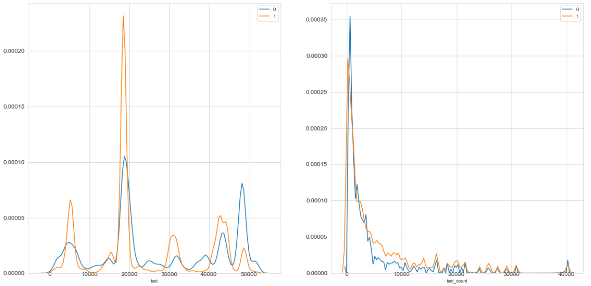

### make&osv

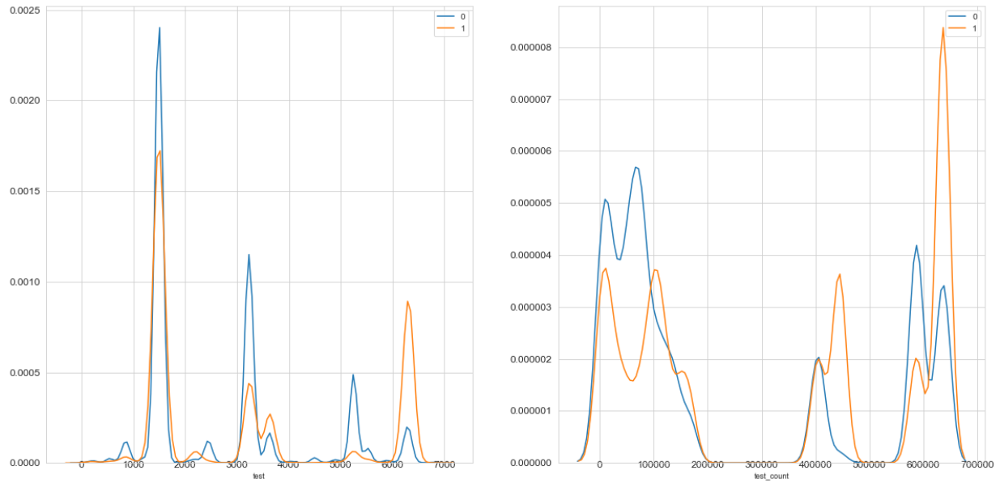